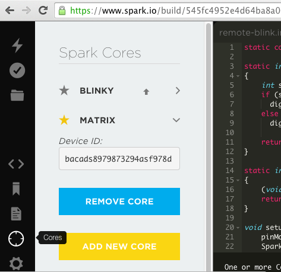
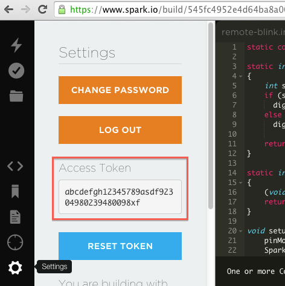

Goals
===

After the workshop, students will be able to:

* Connect a SparkCore to their wifi and claim it on the spark.io website.
* Write a program in the spark.io IDE and flash their cores.
* Use curl to flash the onboard LED.
* Use Javascript to login to the spark servers and track an access token cookie
* Drive external LEDs and RGB LEDs
* Read from buttons
* Read from knobs
* Control 

Example programs
===
You can either paste the source code for these programs into the web IDE
at [spark.io](https://spark.io/) or you can use the
[command line utilities](http://docs.spark.io/cli/).  The command line
has the advantage of allowing you to keep your source code under git or hg
so that you can track questions.

Demo 1
---
Just flashes the blue LED on the board at 1 Hz.  Find out your core name
with the `list` command and then call the flash command on that name:

    spark list
    spark flash CORE_NAME demo1

Demo 2
---
Exposes a function to allow a remote process to turn the LED on or off.
Also has a variable to allow a remote read of the LED state. Flash it:

    spark flash CORE_NAME demo1

And then use the command line utility to turn the LED on, to check
the state, turn it off, as well as see how it handles invalid input:

    spark call CORE_NAME set_led 1
    spark get CORE_NAME led_state
    spark call CORE_NAME set_led 0
    spark call CORE_NAME set_led blah

You can also use curl to do this query, although you will need two pieces
of information: your private access token and your core ID.

For the access token, click on the Gear Box icon and copy the token.

For the device id, select the Cores icon (looks like a target reticle)
and then click the dropdown next to the core name to get the id.

With these two pieces of info, you can use `curl` to turn on the LED by
doing an HTTP `POST` with the access token and argument as form elements:

    DEVICE_ID=(paste the hex device id token...)
    ACCESS_TOKEN=(paste the hex access token...)
    curl "https://api.spark.io/v1/devices/$DEVICE_ID/set_led" \
	-d access_token=$ACCESS_TOKEN \
	-d args="1"

    curl "https://api.spark.io/v1/devices/$DEVICE_ID/set_led" \
	-d access_token=$ACCESS_TOKEN \
	-d args="0"

You can read the value of the variable by doing an HTTP `GET`, passing
in the access token as a query parameter.

    curl "https://api.spark.io/v1/devices/$DEVICE_ID/led_state?access_token=$ACCESS_TOKEN"

Demo 3
---
This one is not a new program to flash, but a Javascript program to run
in your browser that will talk to the core.  It uses the
[Spark Javascript API](http://docs.spark.io/javascript/) and will require
you to login to get the access token.

If you have multiple devices, they will be listed and you can select
which one to toggle the LED on.  If you use `curl` or some other method
to toggle the LED, it should update live on the web page.

Demo 4
---
Tracks the current time and reads an analog value from a knob connected
to A0.  The javascript interface also demonstrates using cookies to store
the login information so that you don't need to keep putting in your
spark.io details.

Demo 5
---

